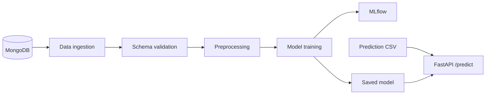

# Network Security — Phishing Detection

An end-to-end machine-learning project for classifying phishing records. It combines data ingestion,
validation, transformation, model training, experiment tracking, and a FastAPI prediction interface.

<p>
  
  
  
  
  
</p>

## Pipeline



## Repository guide

- `NetworkSecurity/components/` — ingestion, validation, transformation, and training stages.
- `NetworkSecurity/pipeline/` — training and batch-prediction orchestration.
- `NetworkSecurity/data_schema/schema.yaml` — expected input schema.
- `final_model/` — model and preprocessor loaded by the prediction API.
- `app.py` — FastAPI training and CSV prediction routes.
- `network_data/` and `valid_data/` — sample input data.

## Run locally

```powershell
python -m venv .venv
.\.venv\Scripts\Activate.ps1
pip install -r requirements.txt
$env:MONGODB_URL_KEY = "<your MongoDB connection string>"
python app.py
```

Open `http://localhost:8000/docs` for the interactive API documentation.

| Route | Purpose |
| --- | --- |
| `GET /train` | Run the training pipeline and write fresh experiment artifacts locally. |
| `POST /predict` | Upload a CSV, run the persisted preprocessing/model pipeline, and render predictions. |

## Notes

- Credentials are read from `MONGODB_URL_KEY`; do not commit `.env` files or connection strings.
- MLflow run output, caches, logs, and prediction exports are intentionally ignored.
- The repository includes the model artifacts required by the prediction demo; no performance claim is made
  without a separately reproducible evaluation report.
